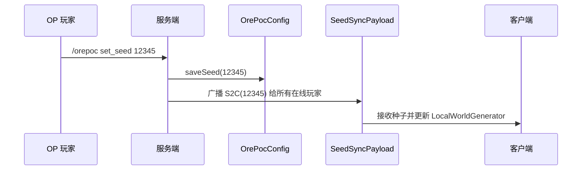
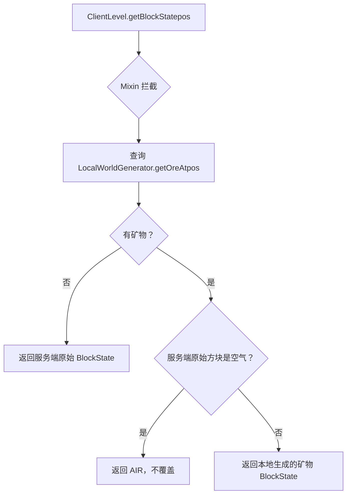

# OrePoc Mod - 重构架构计划

## 1. 概述

将现有的仅服务端矿石扫描模组，重构为 **客户端矿石渲染覆盖** 模组。核心思路：通过 `/orepoc set_seed <seed>` 设置世界种子，基于该种子在客户端本地生成区块、确定矿物分布，然后覆盖服务端下发的矿物方块渲染，同时尊重服务端以空气隐藏的矿物（不揭示）。

---

## 2. 当前状态 vs 目标状态

| 方面 | 当前 | 目标 |
|------|------|------|
| 运行环境 | 仅服务端 (`environment: server`) | 双端 (`environment: *`) |
| 功能 | 扫描真实方块导出 CSV | 客户端渲染覆盖 + 种子设置 |
| 矿物处理 | 读取服务端真实 BlockState | 忽略服务端矿物，使用本地生成结果 |
| 权限 | OP 可执行 | 命令可配置 |
| 渲染 | 无影响 | 拦截矿物方块渲染，替换为本地生成结果 |

---

## 3. 核心算法

```
对于每个被渲染的方块位置 (x, y, z):
    localOre = LocalWorldGenerator.getOreAt(x, y, z)

    如果 localOre 为 空 (无矿物):
        → 渲染服务端原始方块 (不变)
    否则 (本地方块生成器认为此处有矿物):
        serverBlock = 服务端下发的方块
        如果 serverBlock 为 空气:
            → 渲染 空气 (尊重服务端，不揭示被隐藏的矿物)
        否则:
            → 渲染 localOre (替换为本地生成的矿物)
```

### 关键逻辑说明

- **忽略服务端矿物**：当服务端返回的方块是矿物（如 `minecraft:iron_ore`），直接用本地生成的矿物替换。
- **尊重空气**：若服务端在矿物位置返回空气（反 x-ray 机制将矿物替换为空气），则不覆盖，保留空气显示。
- **非矿物方块**：若服务端返回石头、深板岩等非矿物方块，但本地生成器认为此处有矿物，则显示矿物。

---

## 4. 模块详细设计

### 4.1 种子设置命令



### 4.2 渲染覆盖流程



---

## 5. 项目文件结构

```
src/main/java/com/example/orepoc/
├── OrePocMod.java              # [修改] 主类：注册 set_seed 命令 + 网络通道
├── OrePocClient.java           # [新增] 客户端入口点：接收种子、初始化渲染覆盖
├── config/
│   └── OrePocConfig.java       # [新增] 种子持久化（文件存储）
├── generator/
│   └── LocalWorldGenerator.java # [新增] 本地世界生成器（方案 A：使用原版 ChunkGenerator）
├── render/
│   └── OreRenderOverride.java   # [新增] 渲染覆盖逻辑
├── network/
│   └── SeedSyncPayload.java     # [新增] 种子同步 S2C 网络包
└── mixin/
    └── ClientLevelBlockStateMixin.java  # [新增] Mixin 拦截 getBlockState

src/main/resources/
├── fabric.mod.json             # [修改] environment: *, 添加 client 入口点、mixin
└── orepoc.mixins.json          # [新增] Mixin 配置
```

---

## 6. 各模块详细说明

### 6.1 [`OrePocMod.java`](src/main/java/com/example/orepoc/OrePocMod.java) — 服务端主类（修改）

**变更：**
- 保留 `MOD_ID`、`LOGGER`、`ORE_BLOCKS`、`about` 命令
- 移除 `scan` 命令（改为后台诊断功能，可选保留）
- **新增命令：**
```java
dispatcher.register(
    Commands.literal("orepoc")
        .requires(source -> source.permissions().hasPermission(Permissions.COMMANDS_GAMEMASTER))
        .then(Commands.literal("set_seed")
            .then(Commands.argument("seed", IntegerArgumentType.integer())
                .executes(OrePocMod::setSeed)))
);
```
- **新增方法 `setSeed`：**
  - 参数：`seed: int`（注意 Minecraft 种子实际为 `long` 类型，但命令参数用 `integer` 足够测试）
  - 调用 `OrePocConfig.saveSeed(seed)` 持久化
  - 使用 `ServerPlayNetworking.send(player, new SeedSyncPayload(seed))` 广播给所有在线玩家
  - 通知命令发起者操作成功
- **注册网络通道：**
```java
PayloadTypeRegistry.clientboundPlay().register(SeedSyncPayload.TYPE, SeedSyncPayload.CODEC);
```

### 6.2 [`OrePocClient.java`](src/main/java/com/example/orepoc/OrePocClient.java) — 客户端入口点（新增）

```java
public class OrePocClient implements ClientModInitializer {
    @Override
    public void onInitializeClient() {
        // 注册接收 S2C 种子包
        ClientPlayNetworking.registerGlobalReceiver(SeedSyncPayload.TYPE, (payload, context) -> {
            long seed = payload.seed();
            LocalWorldGenerator.INSTANCE.setSeed(seed);
            LocalWorldGenerator.INSTANCE.clearCache();
        });
    }
}
```

### 6.3 [`OrePocConfig.java`](src/main/java/com/example/orepoc/config/OrePocConfig.java) — 种子持久化（新增）

- 存储位置：`<game_dir>/orepoc/seed.txt`
- 纯文本文件，仅含种子数字（如 `12345`）
- 方法：
  - `static long loadSeed()` — 不存在时返回 0 表示未设置
  - `static void saveSeed(long seed)`
  - `static boolean isSeedSet()`

### 6.4 [`LocalWorldGenerator.java`](src/main/java/com/example/orepoc/generator/LocalWorldGenerator.java) — 本地世界生成器（新增）

**方案 A（推荐）：使用 Minecraft 原版 ChunkGenerator**

核心思路：在客户端创建一份独立的 `ChunkGenerator` 实例，使用用户设置的种子，调用其特征生成步骤来产生矿物。

```java
public class LocalWorldGenerator {
    public static final LocalWorldGenerator INSTANCE = new LocalWorldGenerator();
    
    private long seed = 0;
    private boolean initialized = false;
    private ChunkGenerator chunkGenerator;
    private final Map<ChunkPos, Map<BlockPos, BlockState>> oreCache = 
        new LinkedHashMap<ChunkPos, Map<BlockPos, BlockState>>() {
            @Override
            protected boolean removeEldestEntry(Map.Entry<ChunkPos, Map<BlockPos, BlockState>> eldest) {
                return size() > 512; // LRU 缓存限制
            }
        };
    
    public void setSeed(long seed);
    public void clearCache();
    public BlockState getOreAt(BlockPos pos);
    
    private void generateChunk(ChunkPos pos);
}
```

**生成流程（`generateChunk` 内部）：**
1. 从 `MinecraftServer` 获取 `DynamicRegistryManager`（或从客户端持有的 registries 构建）
2. 创建一个 `NoiseChunkGenerator`（或对应维度的生成器）实例，使用设置的种子
3. 创建一个临时的 `WorldGenLevel` 来承载生成结果
4. 调用 `chunkGenerator.buildSurface()` 和 `chunkGenerator.applyBiomeDecoration()` 
5. 遍历生成的区块，提取所有 `ORE_BLOCKS` 集合中的方块
6. 将矿物位置缓存到 `oreCache`

**优化：**
- 懒加载：仅当 `getOreAt` 请求的区块尚未生成时才触发生成
- 异步：可在独立线程中生成，不影响主渲染线程（需要线程安全）
- 种子变更时清空缓存

### 6.5 [`OreRenderOverride.java`](src/main/java/com/example/orepoc/render/OreRenderOverride.java) — 渲染覆盖（新增）

```java
public class OreRenderOverride {
    public static BlockState getOverride(BlockPos pos, BlockState serverState) {
        // 1. 如果种子未设置，不覆盖
        if (!OrePocConfig.isSeedSet()) return null;
        
        // 2. 查询本地生成器
        BlockState localOre = LocalWorldGenerator.INSTANCE.getOreAt(pos);
        if (localOre == null || localOre.isAir()) return null;
        
        // 3. 如果服务端此处为空气，尊重服务端
        if (serverState.isAir()) return null;
        
        // 4. 返回本地矿物
        return localOre;
    }
}
```

### 6.6 [`ClientLevelBlockStateMixin.java`](src/main/java/com/example/orepoc/mixin/ClientLevelBlockStateMixin.java) — Mixin（新增）

```java
@Mixin(ClientLevel.class)
public class ClientLevelBlockStateMixin {
    @Inject(method = "getBlockState", at = @At("RETURN"), cancellable = true)
    private void onGetBlockState(BlockPos pos, CallbackInfoReturnable<BlockState> cir) {
        BlockState original = cir.getReturnValue();
        BlockState override = OreRenderOverride.getOverride(pos, original);
        if (override != null) {
            cir.setReturnValue(override);
        }
    }
}
```

### 6.7 [`SeedSyncPayload.java`](src/main/java/com/example/orepoc/network/SeedSyncPayload.java) — 网络同步（新增）

使用 Fabric API 的 `CustomPacketPayload` 系统（适用于 Minecraft 26.1.2）：

```java
public record SeedSyncPayload(long seed) implements CustomPacketPayload {
    public static final Identifier ID = Identifier.fromNamespaceAndPath(OrePocMod.MOD_ID, "seed_sync");
    public static final CustomPacketPayload.Type<SeedSyncPayload> TYPE = 
        new CustomPacketPayload.Type<>(ID);
    public static final StreamCodec<RegistryFriendlyByteBuf, SeedSyncPayload> CODEC =
        StreamCodec.composite(ByteBufCodecs.VAR_LONG, SeedSyncPayload::seed, SeedSyncPayload::new);
    
    @Override
    public Type<? extends CustomPacketPayload> type() {
        return TYPE;
    }
}
```

### 6.8 [`orepoc.mixins.json`](src/main/resources/orepoc.mixins.json) — Mixin 配置（新增）

```json
{
    "required": true,
    "package": "com.example.orepoc.mixin",
    "compatibilityLevel": "JAVA_25",
    "client": [
        "ClientLevelBlockStateMixin"
    ],
    "injectors": {
        "defaultRequire": 1
    }
}
```

### 6.9 [`fabric.mod.json`](src/main/resources/fabric.mod.json) — 模组配置（修改）

**变更点：**
```json
{
    "environment": "*",
    "entrypoints": {
        "main": ["com.example.orepoc.OrePocMod"],
        "client": ["com.example.orepoc.OrePocClient"]
    },
    "mixins": ["orepoc.mixins.json"]
}
```

---

## 7. 边界情况处理

| 情况 | 处理方式 |
|------|---------|
| 未设置种子 | `OrePocConfig.isSeedSet()` 返回 false，不执行任何覆盖 |
| 种子=0 | 视作有效种子（0 也是有效种子），允许设置 |
| 种子变更 | 调用 `clearCache()` 清空所有已生成的区块缓存 |
| 客户端未安装模组 | 服务端广播的 S2C 包会被忽略，不影响其他客户端 |
| 维度切换 | `LocalWorldGenerator` 需感知维度（通过 `Level.getDimension()` 判断），对下界/末地使用不同的 `ChunkGenerator` |
| 自定义矿物 | `ORE_BLOCKS` 集合用 `Tags` 或 `Block` 注册表判断 |
| 性能 | 懒加载生成 + LRU 缓存 512 区块，渲染时无阻塞等待 |
| 线程安全 | `LocalWorldGenerator` 使用 `synchronized` 或 `ReadWriteLock` 控制缓存访问 |
| 种子为 long 类型 | 命令参数使用 `IntegerArgumentType`，但内部存储为 `long`；可使用 `StringArgumentType` 支持完整 64 位种子 |

---

## 8. 实施步骤

### 步骤 1：更新 fabric.mod.json
- 改 `environment` 为 `"*"`
- 添加 `client` 入口点
- 添加 `mixins` 引用

### 步骤 2：创建 orepoc.mixins.json

### 步骤 3：创建 OrePocConfig.java
- 实现种子文件的读写

### 步骤 4：创建 SeedSyncPayload.java
- 定义 S2C 网络包
- 注册 `PayloadTypeRegistry.clientboundPlay()`

### 步骤 5：修改 OrePocMod.java
- 注册 `set_seed` 命令
- 配置网络通道
- 移除或保留 `scan` 命令

### 步骤 6：创建 OrePocClient.java
- 实现 `ClientModInitializer`
- 注册 S2C 包接收器

### 步骤 7：创建 LocalWorldGenerator.java
- 实现基于原版 `ChunkGenerator` 的本地生成
- 实现懒加载和 LRU 缓存

### 步骤 8：创建 OreRenderOverride.java + Mixin
- 实现 `ClientLevelBlockStateMixin`
- 实现 `OreRenderOverride.getOverride()`

### 步骤 9：更新 README.md

---

## 9. 技术风险与缓解

| 风险 | 缓解措施 |
|------|---------|
| Minecraft 26.1.2 的 `ChunkGenerator` 实例化复杂度 | 使用客户端已有的 `RegistryAccess`；查阅 Yarn 映射确定 API |
| 本地生成器性能开销 | 懒加载 + LRU 缓存 + 可选异步生成 |
| Mixin 与其他模组冲突 | 使用 `@Inject` + `cancellable = true` 而非 `@Overwrite` |
| 网络包版本兼容 | 使用 Fabric API 标准的 `CustomPacketPayload` + `StreamCodec` |
| 维度间矿物差异 | 按维度类型（OVERWORLD/NETHER/END）使用不同的生成逻辑 |

---

## 10. 参考资料（在线浏览总结）

- **Fabric 文档 - 事件系统**：`net.fabricmc.fabric.api.event.Event` 用于监听游戏事件
- **Fabric 文档 - 网络**：`CustomPacketPayload` + `PayloadTypeRegistry` + `ServerPlayNetworking.send` 实现 S2C 同步
- **Fabric 文档 - Mixin**：`@Mixin` + `@Inject` + `CallbackInfoReturnable` 实现方法拦截
- **Fabric Wiki - 矿物生成**：Minecraft 1.19.3+ 使用 JSON 配置 `ConfiguredFeature` + `PlacedFeature`；底层使用 `Feature.ORE` + `OreFeatureConfig`
- **Minecraft 26.1.2**：为极新版本，使用 Yarn 映射；`NoiseBasedChunkGenerator` 是原版主世界区块生成器
